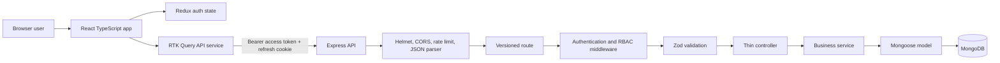

# CommerceOS Project Workflow

This document explains how CommerceOS works from browser startup to database update. It is written as a guide for a new developer joining the project.

## 1. What This Project Is

CommerceOS is an ecommerce administration workspace built with:

- React and TypeScript for the browser application
- Vite for frontend development and production builds
- React Router for page navigation
- Redux Toolkit for authentication state
- RTK Query for API requests and cache invalidation
- React Hook Form and Zod for form validation
- Node.js and Express for the REST API
- MongoDB and Mongoose for persistence
- JWT access tokens and HTTP-only refresh cookies for sessions

The application supports three roles:

| Role | Permissions |
| --- | --- |
| Admin | Dashboard, users, products, orders, roles, activation, order status |
| Manager | Dashboard, products, orders, order status |
| User | Orders and authenticated customer actions |

The frontend hides navigation items for convenience, but the backend is the final authority for every permission.

## 2. High-Level Architecture



## 3. Repository Structure

```text
MERN/
|-- backend/
|   |-- app.js                  Express middleware and route registration
|   |-- server.js               Database startup and HTTP listener
|   |-- config/                 Environment and database configuration
|   |-- controllers/            Request/response adapters
|   |-- middleware/             Authentication, validation, errors, async handling
|   |-- models/                 Mongoose schemas
|   |-- routes/                 Versioned endpoint definitions
|   |-- schemas/                Zod request schemas
|   |-- services/               Business logic
|   |-- utils/                  Token helpers
|   `-- .env.example            Backend configuration template
|-- frontend/
|   |-- src/App.tsx             Lazy routes and session restoration
|   |-- src/components/         Shared application layout
|   |-- src/features/auth/      Redux authentication slice
|   |-- src/pages/              Dashboard and business screens
|   |-- src/routes/             Protected route wrapper
|   |-- src/services/api.ts     RTK Query endpoints and cache tags
|   |-- src/store.ts             Redux store configuration
|   |-- src/types.ts             Shared frontend domain types
|   `-- .env.example            Frontend configuration template
|-- PROJECT_WORKFLOW.md          This guide
`-- README.md                    Project overview and setup summary
```

## 4. Backend Startup Workflow

1. `backend/server.js` loads the Express app, configuration, database connector, and User model.
2. `config/env.js` loads `.env` and provides typed-ish defaults such as port and token lifetime.
3. `config/db.js` first tries the configured `MONGO_URI`.
4. If local MongoDB is unavailable, development can use `mongodb-memory-server`. This data is temporary and can require disk space for its WiredTiger files.
5. The development admin is created only when `SEED_ADMIN_EMAIL` and `SEED_ADMIN_PASSWORD` are configured and the email does not already exist.
6. Express starts listening on the configured port only after database startup completes.

Use `npm start` for one stable backend process. Use `npm run dev` when you need nodemon during normal development.

## 5. Request Workflow

Every API request follows this path:

```text
HTTP request
  -> Express global middleware
  -> versioned route
  -> authenticate middleware, when protected
  -> authorize middleware, when role restricted
  -> Zod validation middleware
  -> asyncHandler
  -> controller
  -> service or model
  -> JSON response
```

### Why controllers are thin

Controllers translate HTTP input into application calls and choose the response status. Business decisions belong in services/controllers dedicated to the business area, so route files do not become large and difficult to test.

### Why asyncHandler exists

Express 4 does not automatically forward rejected promises from async route handlers. `middleware/asyncHandler.js` catches rejected promises and passes them to centralized error middleware instead of allowing the Node process to crash.

## 6. Authentication Workflow

### Register

1. The user submits name, email, and password from the Register page.
2. React Hook Form and Zod validate the fields in the browser.
3. `POST /api/v1/auth/register` validates the request again on the server.
4. The auth service checks email uniqueness.
5. `bcryptjs` hashes the password with a work factor of 12.
6. The User document is created with a default `user` role.
7. The API returns a short-lived access token and sets a refresh token in an HTTP-only cookie.
8. Redux stores the access token and safe user profile in `localStorage`-backed session state.

### Login

1. The Login page sends email and password.
2. The API applies a stricter rate limit to reduce brute-force attempts.
3. The auth service loads `passwordHash` only for password comparison.
4. bcrypt compares the submitted password with the stored hash.
5. The API returns a JWT access token and sets a refresh cookie.
6. RTK Query attaches `Authorization: Bearer <access-token>` to later requests.

### Session restoration

1. On application startup, `App.tsx` calls `POST /api/v1/auth/refresh` if no access token is in Redux.
2. The browser automatically sends the HTTP-only refresh cookie.
3. The server validates the stored hash and expiry.
4. The old refresh token is revoked and a new token is issued.
5. An invalid cookie is cleared and the app stays on the login page.

### Logout

`POST /api/v1/auth/logout` revokes the refresh token in MongoDB, clears the cookie, and the frontend clears Redux/local session state.

## 7. Authorization Workflow

Authentication answers: "Who is this user?"

Authorization answers: "Can this user perform this action?"

The backend token includes the user's role. Routes use `authorize(...)` to enforce permissions:

- Product create/update: admin or manager
- Product delete: admin
- User list/create/update: admin
- Dashboard: admin or manager
- Order creation: authenticated users
- Order status changes: admin or manager

A user cannot bypass these rules by manually navigating to a hidden frontend URL.

## 8. Product Workflow

### Product list

1. `ProductsPage` stores the search text locally.
2. `useProductsQuery` calls `GET /api/v1/products`.
3. The product service builds a MongoDB filter and applies pagination, sorting, search, category, and status filters.
4. RTK Query caches the response under the Product tag.
5. The page renders inventory, price, category, stock, status, and delete controls.

### Product creation

1. The user opens `/products/new` or uses the Add Product panel.
2. The form collects name, description, price, stock, category, and optional image URL.
3. `POST /api/v1/products` validates the request.
4. The backend model validates nonnegative price and stock.
5. RTK Query invalidates Product and Dashboard tags so related screens reload.

### Product deletion

Only administrators can delete products. The UI calls `DELETE /api/v1/products/:id` and invalidates cached product/dashboard data.

## 9. Order Workflow

1. `OrdersPage` loads order history and up to 100 available products.
2. The user selects a product and quantity.
3. The browser prevents empty selections and invalid basic quantities.
4. `POST /api/v1/orders` validates product ids and positive integer quantities.
5. MongoDB updates stock only when the selected product has enough stock.
6. Sold count increases by the ordered quantity.
7. The order stores item name and price snapshots, total, customer, status, and status history.
8. RTK Query refreshes Orders, Products, and Dashboard data.

Order statuses are:

```text
Pending -> Confirmed -> Processing -> Shipped -> Delivered
                         |
                         -> Cancelled
```

The backend still needs a full database transaction for multi-item orders if strict all-or-nothing behavior is required in production.

## 10. User Management Workflow

Only admins can open the Users page or call the user administration API.

### Create user

1. Admin enters name, email, temporary password, and role.
2. `POST /api/v1/users` validates the request.
3. The backend rejects duplicate email addresses.
4. The backend hashes the password and stores only `passwordHash`.
5. The response excludes password data.
6. RTK Query refreshes the user list and dashboard totals.

### Manage user

- Change role with `PATCH /api/v1/users/:id`.
- Activate/deactivate the account with the same endpoint.
- User list responses select safe fields only.

## 11. Dashboard Workflow

1. `DashboardPage` calls `GET /api/v1/dashboard`.
2. The route requires authentication and admin/manager authorization.
3. The controller runs count, aggregate, and recent-record queries in parallel.
4. MongoDB provides total users, products, orders, revenue, recent orders, and recent users.
5. The page renders loading, error, empty, and populated states.
6. Product and order mutations invalidate the Dashboard tag so totals can refresh.

Dashboard values are not hardcoded in the frontend.

## 12. Frontend State Workflow

### Redux Toolkit

Redux stores only session-level client state:

- `accessToken`
- `user`

The auth slice persists this state to `localStorage` so a browser refresh does not immediately lose the session.

### RTK Query

RTK Query owns server state:

- Requests and loading state
- API errors
- Cached dashboard, product, order, and user results
- Cache invalidation after create/update/delete operations

Components should use generated hooks rather than direct `fetch` calls.

## 13. Error and Security Workflow

- Helmet sets common HTTP security headers.
- CORS allows only the configured frontend origin.
- Global rate limiting limits general API traffic.
- Login has a stricter rate limit.
- JSON body size is limited to 1 MB.
- Zod rejects invalid body, query, and URL values before controllers execute.
- MongoDB errors are not returned directly to users in production responses.
- Passwords are hashed and excluded from normal User queries.
- Refresh tokens are stored hashed and expire through a MongoDB TTL index.
- Backend RBAC protects the real data boundary.
- `.env` is ignored and `.env.example` documents required configuration.

## 14. Local Setup

```powershell
cd backend
Copy-Item .env.example .env
npm install

cd ..\frontend
Copy-Item .env.example .env
npm install
```

Configure a development administrator in `backend/.env`:

```dotenv
SEED_ADMIN_EMAIL=admin@example.com
SEED_ADMIN_PASSWORD=Password123!
```

Start the applications in separate terminals:

```powershell
cd backend
npm start
```

```powershell
cd frontend
npm run dev -- --port 3000
```

Open http://localhost:3000.

For persistent data, run local MongoDB on port 27017. The in-memory fallback is for development only and loses data when the backend stops.

## 15. Useful Commands

```powershell
# Backend
cd backend
npm run dev
npm start
npm test

# Frontend
cd frontend
npm run dev
npm run typecheck
npm run build
```

## 16. What Has Been Achieved

### Architecture

- Migrated frontend from Create React App to Vite and TypeScript.
- Added feature-oriented pages and shared layout components.
- Added versioned backend routes.
- Added route, middleware, controller, service, model separation.
- Added centralized errors and async promise handling.

### Authentication and security

- Added registration and email/password login.
- Added bcrypt password hashing.
- Added signed JWT access tokens.
- Added rotating HTTP-only refresh tokens.
- Added logout and stale-cookie cleanup.
- Added server-side RBAC.
- Added Helmet, CORS restrictions, rate limiting, body limits, and validation.

### Business workflows

- Added data-driven dashboard.
- Added product list, search, create, delete, stock, category, status, and image fields.
- Added order list, status filtering, order creation, stock decrement, sold count, and history.
- Added admin user creation, search, roles, and activation controls.
- Added responsive layouts and reflow fixes for product, user, and order panels.
- Added loading, error, and empty states.
- Added dynamic time-based dashboard greetings.

### Quality checks

- Frontend TypeScript checks pass.
- Frontend Vite production builds pass.
- Backend JavaScript syntax checks pass.
- Backend health and login endpoints have been smoke-tested.

## 17. Known Limitations and Next Improvements

These are deliberate follow-up items rather than hidden behavior:

- Add forgot-password and reset-password email workflows.
- Add full automated backend API tests and frontend workflow tests.
- Add an all-or-nothing MongoDB transaction for multi-item orders.
- Add order detail and status-edit screens.
- Add image upload storage instead of accepting image URLs only.
- Add date-range dashboard filtering and sales chart aggregation.
- Add audit logs for role, status, and inventory changes.
- Add CI for lint, typecheck, tests, build, and dependency auditing.
- Use production-grade secret management and HTTPS deployment.

## 18. How to Read the Code as a New Developer

Start here:

1. Read this workflow document.
2. Open `frontend/src/main.tsx` to see application bootstrap.
3. Open `frontend/src/App.tsx` to see routes and session restoration.
4. Open `frontend/src/services/api.ts` to see every frontend API contract.
5. Open `backend/app.js` to see middleware and route registration.
6. Open a route file, such as `backend/routes/productRoutes.js`.
7. Follow it to its controller, then service, then Mongoose model.
8. Run the app and use the browser Network tab to match UI actions to API requests.

This route-to-controller-to-service-to-model path is the main pattern used throughout CommerceOS.
