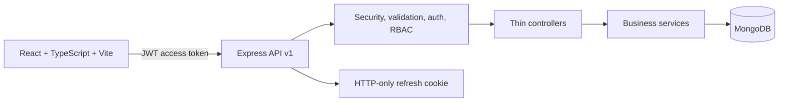

# CommerceOS

CommerceOS is a portfolio-grade MERN administration workspace for ecommerce operations. It preserves the original demo's product workflow while introducing a realistic API boundary, role-based access, secure sessions, operational dashboards, and a maintainable React architecture.

## Architecture



The backend follows `route -> middleware -> controller -> service -> model -> MongoDB`. The frontend uses feature-oriented TypeScript modules, Redux Toolkit for session state, RTK Query for cached API data, React Hook Form, and lazy-loaded routes.

## Features

- JWT access tokens with short expiry and rotating, hashed refresh tokens
- Register, login, logout, session restoration, and role-based authorization
- Admin, manager, and user roles enforced by the API
- Data-backed dashboard totals and recent order activity
- Product search, pagination, category, status, stock, pricing, and deletion
- Order listing with status filtering and atomic stock decrement on order creation
- Admin user search, role changes, and activation controls
- Helmet, restricted CORS, request limits, rate limiting, validation, sanitized errors
- Responsive, keyboard-friendly operations UI with loading, error, and empty states

## Stack

- Frontend: React 18, TypeScript, Vite, React Router, Redux Toolkit, RTK Query, React Hook Form, Zod
- Backend: Node.js, Express, Mongoose, MongoDB, JWT, bcryptjs, Zod
- Quality: TypeScript checks, Vite production build, Node test runner foundation

## Local setup

Prerequisites: Node.js 20+, npm, and MongoDB 7+ (or a MongoDB-compatible connection string).

```powershell
cd backend
Copy-Item .env.example .env
npm install

cd ..\frontend
Copy-Item .env.example .env
npm install
```

Set `SEED_ADMIN_EMAIL` and `SEED_ADMIN_PASSWORD` in `backend/.env` for a development administrator. Start each application in a separate terminal:

```powershell
# backend
cd backend
npm run dev

# frontend
cd frontend
npm run dev
```

Open http://localhost:5173. Never commit `.env` or use development seed credentials in production.

## Environment variables

Backend variables are documented in [backend/.env.example](backend/.env.example). The frontend uses `VITE_API_URL`, documented in [frontend/.env.example](frontend/.env.example). JWT secrets must be long, random, different values in deployed environments.

## API overview

- `POST /api/v1/auth/register`
- `POST /api/v1/auth/login`
- `POST /api/v1/auth/refresh`
- `POST /api/v1/auth/logout`
- `GET /api/v1/auth/me`
- `GET|POST|PUT|DELETE /api/v1/products`
- `GET|POST|PATCH /api/v1/orders`
- `GET|PATCH /api/v1/users` (admin)
- `GET /api/v1/dashboard` (admin or manager)
- `GET /api/health`

## Checks

```powershell
cd backend; npm test
cd ..\frontend; npm run typecheck; npm run build
```

## Database design

`User` stores identity, role, activation state, and a bcrypt password hash. `RefreshToken` stores only a SHA-256 token hash with TTL expiry and revocation metadata. `Product` stores catalog and inventory data. `Order` stores immutable item prices, totals, status, and status history. Login-attempt records from the original demo are retained as legacy data but are no longer used for authentication.

## Future improvements

Add password reset email delivery, image storage through object storage, a full order detail workflow, sales time-series aggregation, background jobs, audit logs, OpenAPI generation, and CI deployment previews.
